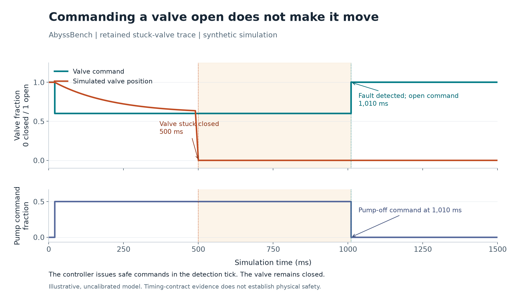

# Publication audit, 2026-10-04

This review happened after the original implementation and source publication at
commit `39dfee9`. Walter separately authorized project cleanup and publication of
a combined experiment article. These fixes must not be attributed to the initial
implementation run. The original release JSON artifacts remain byte-identical to
their archived hashes; this directory contains the new checks and results.

## Findings and repairs

The original suite independently reran with **116 passes in 75.26 seconds**.
Subsequent inspection found two uncovered input/ordering cases:

1. A trace with one observation reached RTAMT 0.4.10's offline interpreter,
   which raised `UnboundLocalError` even for a pointwise range predicate. The
   adapter now duplicates a singleton only inside the numerical predicate call
   and discards the extra result. The actual event stream and observation window
   stay unchanged; an outstanding response deadline remains inconclusive.
2. A range or sample-age response could count a command earlier in the same
   timestamp than its triggering measurement. The monitor now retains event
   sequence provenance and requires the response to follow its prerequisites.

[Eight literal regression cases](../../tests/acceptance/test_publication_audit.py)
were written before the fix: **six failed and two passed**. Their original
failures are retained in [regressions-before.txt](regressions-before.txt) and
[regressions-before.json](regressions-before.json). The repaired regressions plus
existing replay checks produced **23 passes** in [regressions-after.txt](regressions-after.txt).
The expectations were not relaxed.

## Executed verification

| Check | Outcome | Evidence |
| --- | --- | --- |
| Original suite, before changes | 116 passed; 75.26 s | [original-suite-run.json](original-suite-run.json) |
| Current full suite | 124 passed; 87.69 s | [full-suite.txt](full-suite.txt), [full-suite.json](full-suite.json) |
| Fresh wheel in a new venv | 123 passed, one property test deselected; 14.85 s | [fresh-wheel.txt](fresh-wheel.txt), [fresh-wheel.json](fresh-wheel.json) |
| New consumer setup/workflow | Expected failed thermal input, correction, controller and demo passed; 61.35 s | [consumer-walkthrough.json](consumer-walkthrough.json) |
| Exactly 10,000 events, three measurements | 1.65–1.87 s; maximum sampled process RSS 49.86 MiB; all pass | [performance.json](performance.json) |
| Ruff, mypy, pip check | Passed; mypy checked 12 modules | [quality-checks.txt](quality-checks.txt) |

The full suite includes one Hypothesis test configured for 1,000 bounded
examples; the fresh-wheel run omits that same expensive property test after it
has passed in the full suite. Five warnings originate in pinned upstream ANTLR.
The fresh consumer imported from `site-packages`, as recorded in
[wheel-import-location.txt](wheel-import-location.txt). Code and oracle hashes
agree across the full-suite, fresh-wheel, performance and consumer records.
Timing was measured on the same Windows/Python 3.12 environment, with warmed
package cache and concurrent review work; it is not a controlled speed comparison.

To rerun tests without replacing the original release record:

```powershell
$env:AB_EVIDENCE_PATH = "artifacts/publication-audit-tests.json"
.venv\Scripts\python -m pytest -q --tb=short
```

## Article figure



The figure replots the original release's raw stuck-valve trace. Injection occurs
at 500 ms; mismatch detection and pump-off/valve-open commands occur at 1,010 ms.
Actual simulated valve position stays zero. This illustrates command issuance
versus mechanical response, not physical qualification.

Data: [stuck-valve-events.jsonl](stuck-valve-events.jsonl).
Source: [plot_audit_timeline.py](../../tools/plot_audit_timeline.py).
Vector export: [stuck-valve-timeline.svg](stuck-valve-timeline.svg).
Hashes and plotting version: [figure-provenance.json](figure-provenance.json).
Reproduce in an optional plotting environment with `matplotlib==3.11.2`, then
run `python tools/plot_audit_timeline.py`. Matplotlib is not an application dependency.

## Limits remain

This is software evidence for a narrow integration. The independent oracle means
separately implemented expectations, not a blinded team or an outside practitioner.
There is no physical validation, external adoption evidence, distributed clock
support, hostile-code sandbox, or live model-repair campaign. The generic monitor
works at recorded observation times; these traces cannot establish behavior in
unobserved intervals. The original local benchmark and agent consumer remain
useful evidence, but neither measures engineering productivity against a human.
CI and an independent engineer's trial remain explicit follow-up work.
